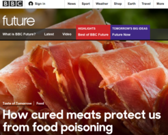

#

## Scalable knowledge

## Handholding is your enemy
[Expand your engineers' knowledge]{.fragment}

[Expand your teams' knowledge]{.fragment}

[Expand your users' knowledge]{.fragment}

[Can't train everybody]{.fragment}

[Can't meet everyone]{.fragment}

[Screencasts the most effective so far]{.fragment}

<!--
Screencasts rock as they are relatively easy to produce and can be viralised
-->

## Multiple sources of information

<blockquote class="fragment" cite="https://twitter.com/danielgiri/status/983384285020409858">
"All applications evolve to become Content Management Systems or are eventually replaced by ones that do."
</blockquote>

[Wiki-style]{.fragment} [ticket system]{.fragment} [Documents]{.fragment} [Emails]{.fragment} 
[PR discussion]{.fragment} [code issues]{.fragment} [TODOs in the code]{.fragment}
[Email attachments]{.fragment} [Markdown]{.fragment} [YAML]{.fragment}
[ReadTheSource(tm)]{.fragment} [MyCodeDoesn'tNeedComments(tm)]{.fragment} [It's in the production server somewhere]{.fragment}

## Steal a page from the content people
[Digital journalism has been doing this for some time]{.fragment}

[Single data entry as a principle]{.fragment}

[Produce once, publish multiple times]{.fragment}

{.fragment}
